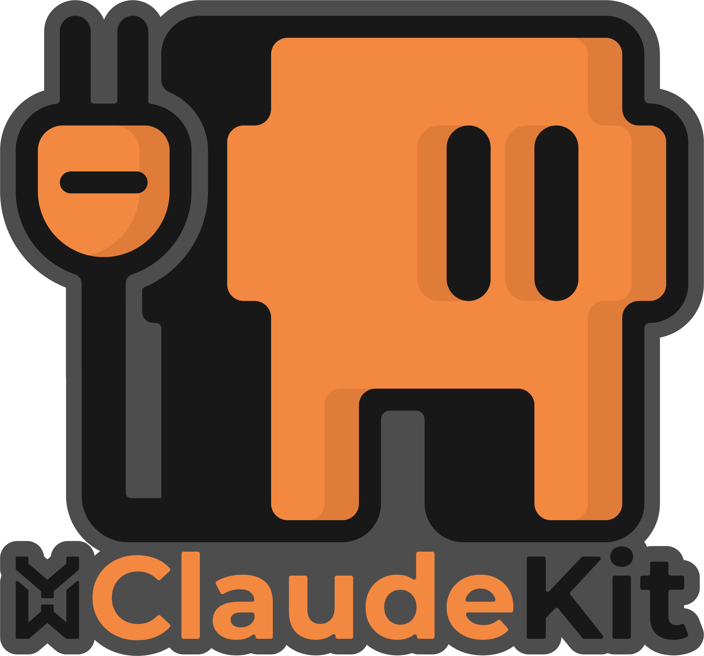
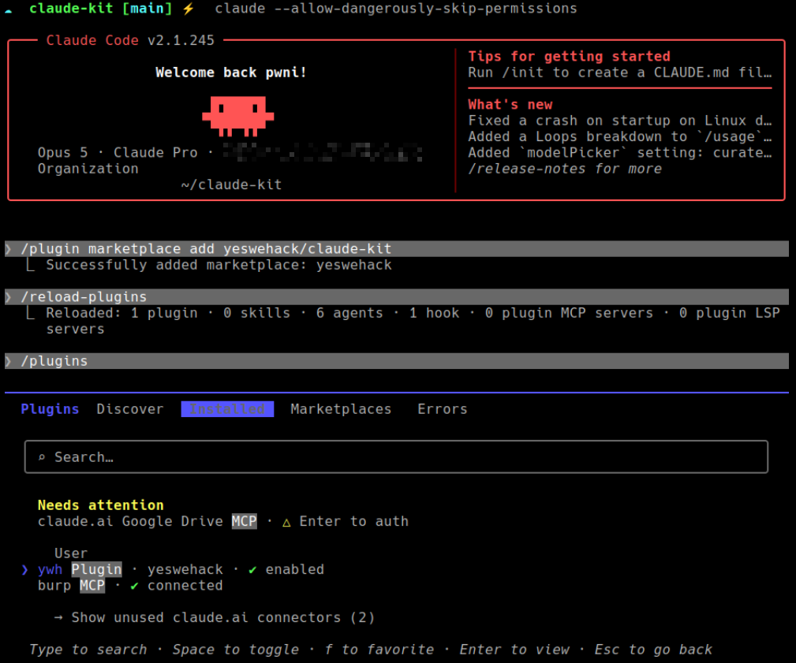
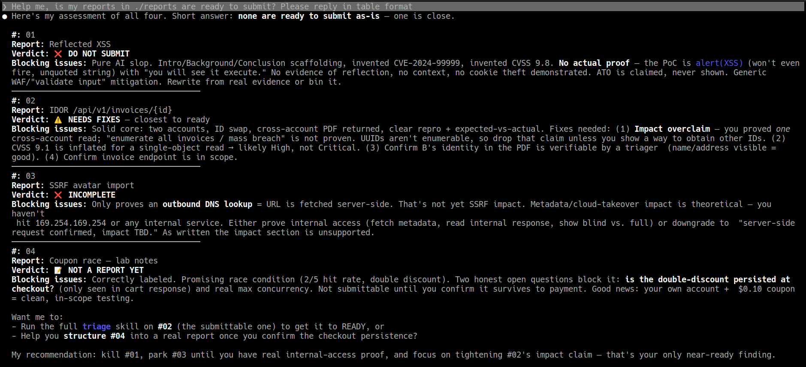
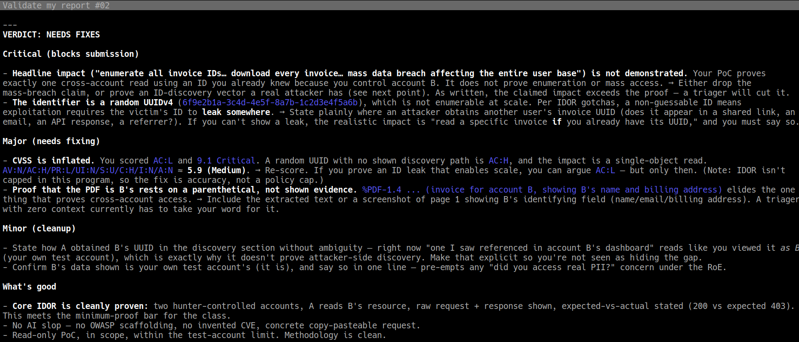
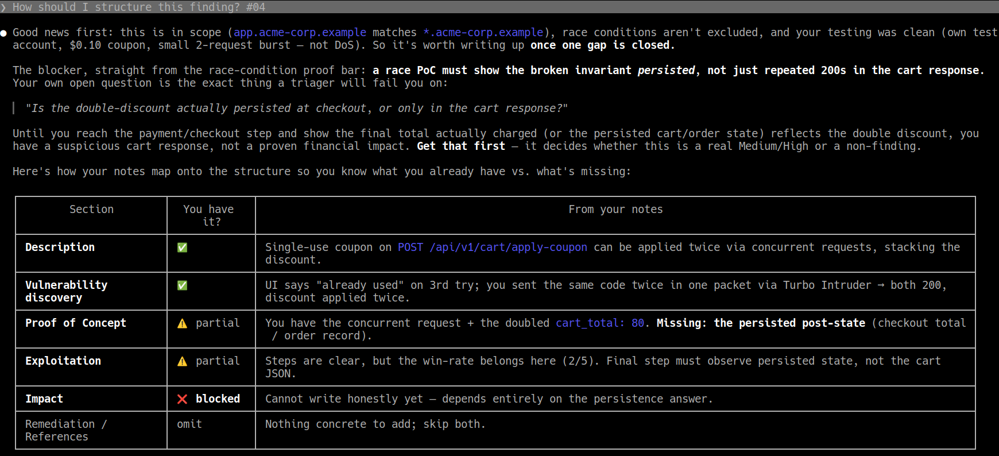
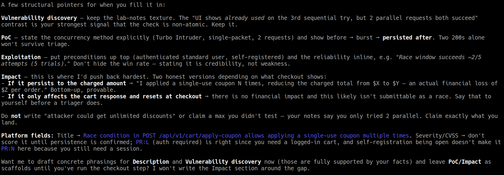

<p align="center">
  
</p>

<h1 align="center">YesWeHack Claude Kit</h1>

A Claude Code plugin that helps bug bounty hunters write clear,
well-evidenced reports - the kind a triager can validate quickly.

Used well, AI speeds up report writing. The risk is that it can fill in
technical details no one actually verified. This toolkit keeps the
assistant honest: it drafts, structures, and validates reports **only
from the facts you provide** - the real URLs, payloads, responses, and
observed behavior - and asks instead of guessing when something is
missing.

One install adds two things to Claude Code: an **always-on discipline
layer** applied to every session, and **three on-demand skills** for
writing, triaging, and class-specific checks.

> **Full walkthrough:** [Triager-grade reports with Claude
> Code](https://www.yeswehack.com/fr/learn-bug-bounty/triager-grade-reports-claude-code)
> on YesWeHack.

---

## Install

The plugin is its own marketplace, so installation is two commands
inside Claude Code:

```
/plugin marketplace add yeswehack/claude-kit
/reload-plugins
```


Run `/plugin` to confirm it is listed and enabled - both layers are now
active.

By default the plugin installs at **user scope** (active in all your
projects). The installer also offers project and local scopes if you
prefer to keep it to a single workspace.

---

## In action

Ask whether a folder of drafts is ready to submit - it reads the scope
and hands back one verdict per draft, worst-first:



Pick the near-ready one and it runs the full triage. It keeps the real
IDOR but kills the "mass data breach affecting the entire user base"
overclaim - the invoice ID is a random UUIDv4, not enumerable, so `AC:H`
and the proof only shows a single cross-account read - and deflates the
draft's inflated `9.1` to a defensible **~5.9 Medium**:



It drafts too, without inventing what you didn't prove. Handed raw lab
notes on a coupon race condition, it maps them onto the report sections
and **blocks the Impact section**: the double discount was only seen in
the cart response, never confirmed persisted at checkout, so there is no
financial impact to claim yet.



Then it turns the notes into per-section pointers - two honest Impact
versions to write depending on what checkout reveals, `PR:L` justified,
CVSS left unscored until persistence is confirmed - and refuses to claim
a maximum you never tested (*"don't write attacker could get unlimited
discounts"*):



---

## How it works

Two layers, one install:

**1. Always-on rules** - injected into context at the start of every
session via a bundled `SessionStart` hook. They keep unverified claims
out of the report from the start: never invent facts, never write
theoretical impact, never pad with OWASP boilerplate, and flag
out-of-scope or unprovable claims - during investigation, drafting, and
validation alike. Nothing to copy or configure; they apply from your
first prompt.

**2. Three on-demand skills** - loaded only when you invoke them (or when
your phrasing matches their trigger):

| Skill | Invoke it for... | What it does |
|---|---|---|
| `/ywh:write` | "how should I structure this?", "help me write this up" | Shapes the draft into the required sections (aligned with YesWeHack guidance) with per-section format rules. Drafts from your facts, asks when one is missing. |
| `/ywh:triage` | "is this ready to submit?", "triage this", "validate my draft" | Returns a verdict (READY / NEEDS FIXES / DO NOT SUBMIT) with concrete fixes. Runs the unverified-output checklist internally and the class gotchas for whatever you claimed. |
| `/ywh:gotchas` | you name a vulnerability class | Loads that class's minimum proof, common N/A (auto-close) patterns, and impact-overclaim traps. Covers XSS, SQLi, SSRF, IDOR, CSRF, RCE, SSTI, XXE, open redirect, auth bypass, info disclosure, race condition, CORS, and path traversal / LFI. |

Skills are namespaced (`/ywh:...`) so they never clash with your own.
Auto-invocation is semantic, not guaranteed - for the final
pre-submission check, invoke `/ywh:triage` explicitly.

---

## A typical flow

1. **Investigate** as usual. The always-on rules keep the assistant from
   validating unproven leads - suspicious behavior gets "not yet a bug,
   here's what would prove it", not a green light.
2. **Confirmed a bug?** Ask *"how should I structure this finding?"* -
   `/ywh:write` shapes it from your notes and flags anything missing
   instead of filling the gap.
3. **Before submitting**, run `/ywh:triage` for a verdict and
   line-by-line fixes, checked against the program scope.

---

## Notes

- **Update to the latest release:** `/plugin update ywh@yeswehack`.
- **Work on the plugin locally:** clone it, add it as a local marketplace
  by path, and reload after edits:
  ```
  git clone https://github.com/yeswehack/claude-kit
  /plugin marketplace add ./claude-kit
  /reload-plugins
  ```
- **New to Claude Code plugins?** See Anthropic's docs:
  [Create plugins](https://code.claude.com/docs/en/plugins) ·
  [Marketplaces](https://code.claude.com/docs/en/plugin-marketplaces) ·
  [Install plugins](https://code.claude.com/docs/en/discover-plugins).
- **License:** [GPL-3.0-or-later](LICENSE).
